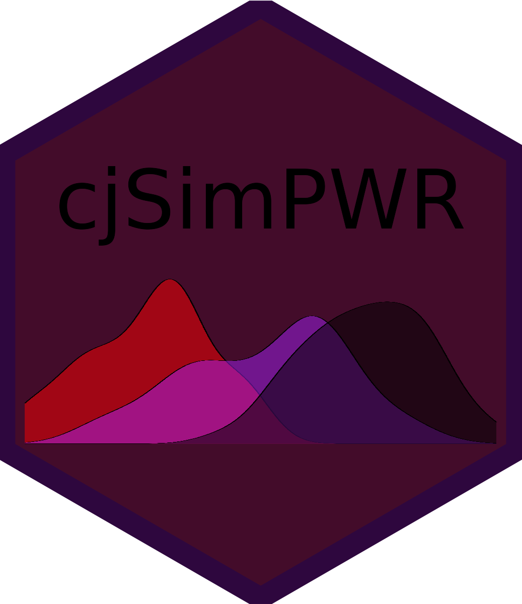

  
  
```{r pressure, echo=FALSE, fig.cap="", out.width = '50%', fig.align="center"}

```

Using the simulation framework developed in [Stefanelli, A., & Lukac, M. (2020)](https://osf.io/preprints/socarxiv/spkcy/), this R package provides an extensive set of functions to simulate conjoint data, calculate power, Type S and Type M error for forced-choice conjoint experiments that use the [Hainmueller, J., Hopkins, D., & Yamamoto, T. (2014)](https://www.cambridge.org/core/journals/political-analysis/article/causal-inference-in-conjoint-analysis-understanding-multidimensional-choices-via-stated-preference-experiments/414DA03BAA2ACE060FFE005F53EFF8C8) framework. 

A shiny app that can be used without any R or programming knowledge is available for simpler designs [https://mblukac.shinyapps.io/conjoints-power-shiny/](https://mblukac.shinyapps.io/conjoints-power-shiny/). 

## Installation

You can install the development version of cjsimPWR using the following lines of code in R:

```{r, eval = FALSE}
if(!require(devtools)) install.packages("devtools")
library(devtools)
devtools::install_github("albertostefanelli/cjsimPWR")
```

## Usage


The current version of the `power_sim()` function can be utilized to calculate *a prior* power, Type S, and Type M errors based on the design parameters of a conjoint experiment. The function can be used when the treatment effect (i.e., AMCE) is either (1) considered to be homogeneous across all respondents or (2) expected to differ substantially across different segments of the population. In the latter case, the effect of an experimental attribute may vary depending on some respondent's characteristics [e.g., Kirkland and Coppock 2018](https://link.springer.com/article/10.1007/s11109-017-9414-8). In such cases, AMCEs and the resulting power measures are calculated through subgroup analysis (see, [Leeper, T., Hobolt, S., & Tilley, J., 2020](https://www.cambridge.org/core/journals/political-analysis/article/abs/measuring-subgroup-preferences-in-conjoint-experiments/4F2C21AC02753F1FFF2F5EA0F943C1B2)) 

`power_sim()` calculates power measures using cluster-robust standard error at the individual level as suggested by [Hainmueller, J., Hopkins, D., & Yamamoto, T. (2014)](https://www.cambridge.org/core/journals/political-analysis/article/causal-inference-in-conjoint-analysis-understanding-multidimensional-choices-via-stated-preference-experiments/414DA03BAA2ACE060FFE005F53EFF8C8), making it more versatile and accurate compared to non-parametric techniques. The use of cluster-robust standard errors is particularly relevant when there is a significant amount of treatment heterogeneity at the individual level that cannot be accounted for using observed covariates. The amount of treatment heterogeneity can be set using the `sigma.u_k` argument in the `power_sim()`. A value between 0.05 and 0.15 is deemed appropriate in most cases. The usage of cluster-robust standard errors is also advice when the conjoint design is small (e.g., 2 attributes with 2 levels each), but the number of tasks is large (e.g., ≥ 20) (for more details on this point, see [Abadie et al., 2022](https://academic.oup.com/qje/article/138/1/1/6750017)).

## Examples

```{r, eval = FALSE}

# This calculates power for an experiments with the following attributes with no expected interaction effects
# Number of attributes (n_attributes): 3
# Number of levels Attribute 1 (n_levels): 2
# Number of levels Attribute 2 (n_levels): 3
# Number of levels Attribute 1 (n_levels): 5
# Number of respondents (units): 500
# Number of tasks per respondent (n_tasks): 5
# Hypothesized AMCE compared to reference level (true_coef): 
#### Attribute 1 - Level 1 (ref: 0): 0.20 
#### Attribute 2 - Level 1 (ref: 0): -0.1 
#### Attribute 2 - Level 2 (ref: 0): 0.10 
#### Attribute 3 - Level 1 (ref: 0): -0.03 
#### Attribute 3 - Level 2 (ref: 0) -0.1 
#### Attribute 3 - Level 3 (ref: 0): -0.1 
#### Attribute 3 - Level 4 (ref: 0): 0.1
# Individual level heterogeneity (sigma.u_k): 0.05 
# Number of simulations (sim_runs): 100
# Seed for reproducibility of the simulation results (seed) : 2114

df_power <- power_sim(
  n_attributes = 3,
  n_levels = c(2, 3, 5),
  units = 600,
  n_tasks = 5,
  true_coef = list(0.2, c(-0.1, 0.1), c(-0.03, -0.1, -0.1, 0.1)),
  sigma.u_k = 0.05,
  sim_runs = 100,
  seed = 2114
)

df_power |> print(n=40)


# This calculates power for an experiments with 3 subgroups of respondents (Democrat, Independent, Republican) with Hypothesized differences in conditional AMCEs (i.e., subgroup analysis). 

df_power_interaction <- power_sim(
          n_attributes = 3,
          n_levels = c(2, 3, 6),
          n_tasks = 4,
          group_name = c("Democrat", "Independent", "Republican"),
          units = c(500, 200, 500),
          true_coef = list("Democrat" = list(0.2, c(-0.1, 0.1), c(-0.1, -0.1, -0.1, 0.1, -0.03)),
                           "Independent" = list(0.1, c(-0.2, 0.05),  c(-0.1, 0.1, 0.1, 0.3, 0.01)),
                           "Republican" = list(0.1, c(-0.1, -0.0005),  c(-0.1, 0.2, -0.1, 0.1, -0.01))
                           ),
          sigma.u_k = 0.05,
          sim_runs = 100,
          seed = 12
)

df_power_interaction |> print(n=40)

```
