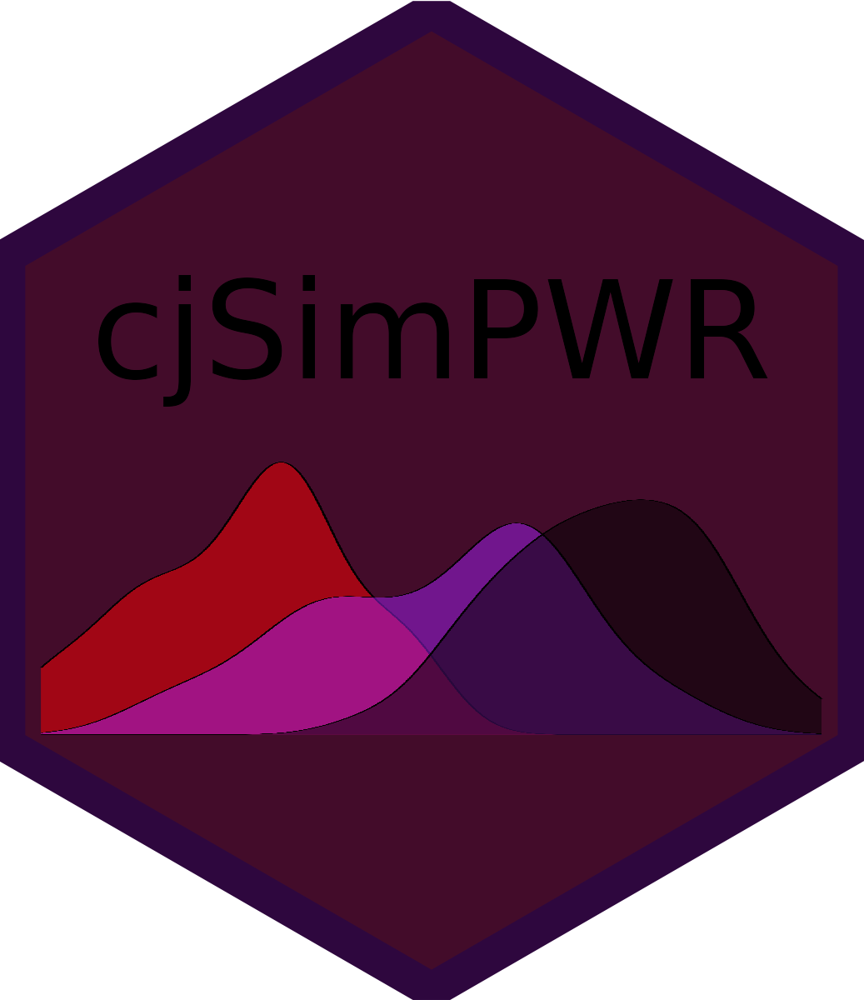

cjsimPWR: Power Analyses for Conjoint Experiments Using Simulation
================

<!-- README.md is generated from README.Rmd. Please edit that file -->

|  |
|:----------------------------------------------------------------:|

[](https://github.com/albertostefanelli/cjsimPWR/actions/workflows/R-CMD-check.yaml)

Using the simulation framework of [Stefanelli & Lukac
(2020)](https://doi.org/10.31235/osf.io/spkcy), `cjsimPWR` calculates
the statistical power of forced-choice conjoint experiments. You
describe the design (attributes and levels), the sample (respondents and
tasks per respondent) and the average marginal component effects (AMCEs;
[Hainmueller, Hopkins & Yamamoto,
2014](https://doi.org/10.1093/pan/mpt024)) you expect. The package
simulates the experiment many times, estimates the AMCEs each time as an
applied study would, and reports power, Type I error for null targets,
Type S and Type M errors (Gelman & Carlin, 2014) and coverage, each with
its Monte Carlo standard error. Respondent heterogeneity and respondent
subgroups can be added, and there is no limit on the number of
attributes.

| **WARNING** |
|:--:|
| This is a development version of the package. Version 0.3.0 changed the simulation model and the arguments of `power_sim()`, so results and code from earlier versions do not carry over unchanged; see the [release notes](https://github.com/albertostefanelli/cjsimPWR/blob/main/NEWS.md). If you find a bug, an inconsistency or an error, please open an issue on GitHub or drop a line at alberto.stefanelli(at)yale.edu. General suggestions on how to improve the package are also welcome. |

## Installation

``` r
if (!require(devtools)) install.packages("devtools")
devtools::install_github("albertostefanelli/cjsimPWR")
```

## Power for a conjoint design

Attributes are given by their numbers of levels (or level labels), and
AMCEs by one vector per attribute, one value per non-reference level.
The design below has two attributes, with 2 and 3 levels; 600
respondents each complete 5 tasks. One AMCE is zero, so the output also
reports Type I error.

``` r
library(cjsimPWR)

power <- power_sim(
  levels    = c(2, 3),
  true_amce = list(0.05, c(-0.05, 0)),
  units     = 600,
  n_tasks   = 5,
  seed      = 2114
)
power
#> Conjoint simulation: 1000 runs; logit DGP; CR1 / normal inference.
#>  type group attribute level true_amce Power         Type I error  Type S        Type M        Coverage      Runs (failed) Valid runs
#>  amce <NA>  var_1     1      0.05     0.976 (0.005)               0.000 (0.000) 1.029 (0.008) 0.948 (0.007) 1000 (0)      1000
#>  amce <NA>  var_2     1     -0.05     0.874 (0.010)               0.000 (0.000) 1.083 (0.009) 0.946 (0.007) 1000 (0)      1000
#>  amce <NA>  var_2     2      0.00                   0.054 (0.007)                             0.946 (0.007) 1000 (0)      1000
#> Monte Carlo standard errors in parentheses.
#> Power is for non-null targets; Type I error is for null targets, not nonsignificant estimates.
#> Measures are conditional on runs with valid inference.
```

Each row is one non-reference level, compared with its attribute’s first
(reference) level. `Type S` is the share of significant estimates with
the wrong sign, and `Type M` how much significant estimates overstate
the true AMCE on average (1.08 means 8 percent too large). Both are
small when power is high but grow quickly when it is low; see the
[error-rates
guide](https://github.com/albertostefanelli/cjsimPWR/blob/main/docs/error_rates.md#type-s-and-type-m-errors).
All rates and their MCSEs are computed over `n_valid`, the runs with
usable inference — inspect `$failures` for the rest. Zero targets report
`Type I error`, the false-positive rate, instead of power.

## Heterogeneous preferences

`sigma` is a single value: the standard deviation, across respondents,
of each respondent’s own AMCE on the probability scale — with
`sigma = 0.05` and an AMCE of 0.03, individual effects are spread with
SD 0.05 around 0.03. Heterogeneity leaves the average AMCEs unchanged
but makes the choices of a respondent more alike, which is what
respondent-clustered standard errors account for. There is no generally
valid value; use pilot evidence, or compare separate calls at a few
candidate values with the AMCEs held fixed. Details are in the
[simulation model
guide](https://github.com/albertostefanelli/cjsimPWR/blob/main/docs/simulation_model.md).

``` r

power_sim(levels = c(2, 3),
          true_amce = list(0.05, c(-0.05, 0)),
          units = 600,
          n_tasks = 5,
          sigma = 0.05,
          seed = 2114)
```

## Subgroups

When the AMCEs are expected to differ between groups of respondents,
such as partisans, give the group names, the number of respondents in
each group and one set of AMCEs per group. `power_sim()` then reports
the power for each group’s AMCEs and for the difference between each
group’s AMCE and that of the first group — here, Republican minus
Democrat, since Democrat is listed first.

``` r

groups <- power_sim(
  levels    = c(2, 3),
  groups    = c("Democrat", "Republican"),
  units     = c(Democrat = 500, Republican = 300),
  n_tasks   = 4,
  true_amce = list(Democrat   = list(0.10, c(-0.05, 0.05)),
                   Republican = list(0.02, c(-0.05, 0.05))),
  seed      = 12
)

subset(groups$performance, type == "difference")[, c("group", "attribute", "level", "reference_level",
  "power", "power_mcse", "type_1_error", "type_1_error_mcse")]
#>                   group attribute level reference_level power power_mcse type_1_error type_1_error_mcse
#> 7 Republican - Democrat     var_1     1               0 0.867  0.0107383           NA                NA
#> 8 Republican - Democrat     var_2     1               0    NA         NA        0.052       0.007021111
#> 9 Republican - Democrat     var_2     2               0    NA         NA        0.044       0.006485677
```

A difference compares the causal effect of the same level for the two
named groups (the display label names the non-reference group first, its
reference group second); it is not a test of overall favourability, and
it depends on the attribute’s reference level. See the [error-rates
guide](https://github.com/albertostefanelli/cjsimPWR/blob/main/docs/error_rates.md#reading-the-output)
for interpreting zero-target contrasts and their calibration
uncertainty.

## Comparing candidate sample sizes

For a focal effect and a target power, compare candidate values of
`units` while holding every other setting fixed. Below, the target is
80% power to detect the first attribute’s AMCE of 0.05.

``` r
# sim_runs = 300 keeps this example fast; use the default 1000 (or more) for a real comparison
candidate_units <- c(200, 400, 600, 800)

candidates <- lapply(candidate_units, function(n) {
  power_sim(levels = c(2, 3),
            true_amce = list(0.05, c(-0.05, 0)),
            units = n,
            n_tasks = 5,
            sim_runs = 300,
            seed = 2114)
})

focal <- do.call(rbind, lapply(seq_along(candidates), function(i) {
  perf <- candidates[[i]]$performance[1, ]
  data.frame(units = candidate_units[i],
            power = perf$power,
            power_mcse = perf$power_mcse,
             n_valid = perf$n_valid,
             n_failed = sum(candidates[[i]]$failures$n_failed))
}))

focal
#>   units     power  power_mcse n_valid n_failed
#> 1   200 0.6200000 0.028023799     300        0
#> 2   400 0.8733333 0.019202623     300        0
#> 3   600 0.9700000 0.009848858     300        0
#> 4   800 0.9900000 0.005744563     300        0
```

Compare `power` against the 80% target, allowing for `power_mcse`;
inspect `n_failed` and `$failures` for any run that did not produce a
usable estimate. Near the threshold, increase `sim_runs` for more
precision before deciding between neighbouring candidates. This compares
the candidates shown; it does not search for, or guarantee, the minimum
sample size that reaches the target.

## Further guides

| To… | See |
|----|----|
| Understand the choice model, `sigma` and its assumptions | [simulation model](https://github.com/albertostefanelli/cjsimPWR/blob/main/docs/simulation_model.md) |
| Choose a clustering/inference method | [clustering](https://github.com/albertostefanelli/cjsimPWR/blob/main/docs/clustering.md) |
| Interpret power, Type I error, Type S and Type M, or check a null | [error rates](https://github.com/albertostefanelli/cjsimPWR/blob/main/docs/error_rates.md) |
| Investigate calibration diagnostics or tune precision | [calibration](https://github.com/albertostefanelli/cjsimPWR/blob/main/docs/calibration.md) |
| Compare with closed-form power formulas (cjpowR) | [closed-form comparison](https://github.com/albertostefanelli/cjsimPWR/blob/main/docs/closed_form.md) |
| Compare with DeclareDesign | [DeclareDesign](https://github.com/albertostefanelli/cjsimPWR/blob/main/docs/declaredesign.md) |

## References

Gelman, A., & Carlin, J. (2014). Beyond power calculations: Assessing
Type S (sign) and Type M (magnitude) errors. *Perspectives on
Psychological Science*, 9(6), 641–651.
<https://doi.org/10.1177/1745691614551642>

Hainmueller, J., Hopkins, D. J., & Yamamoto, T. (2014). Causal inference
in conjoint analysis: Understanding multidimensional choices via stated
preference experiments. *Political Analysis*, 22(1), 1–30.
<https://doi.org/10.1093/pan/mpt024>

Stefanelli, A., & Lukac, M. (2020). Subjects, trials, and levels:
Statistical power in conjoint experiments. SocArXiv.
<https://doi.org/10.31235/osf.io/spkcy>

## Issues and citation

Report bugs, inconsistencies or suggestions as a GitHub issue, or write
to alberto.stefanelli(at)yale.edu. Run `citation("cjsimPWR")` for how to
cite this package.
