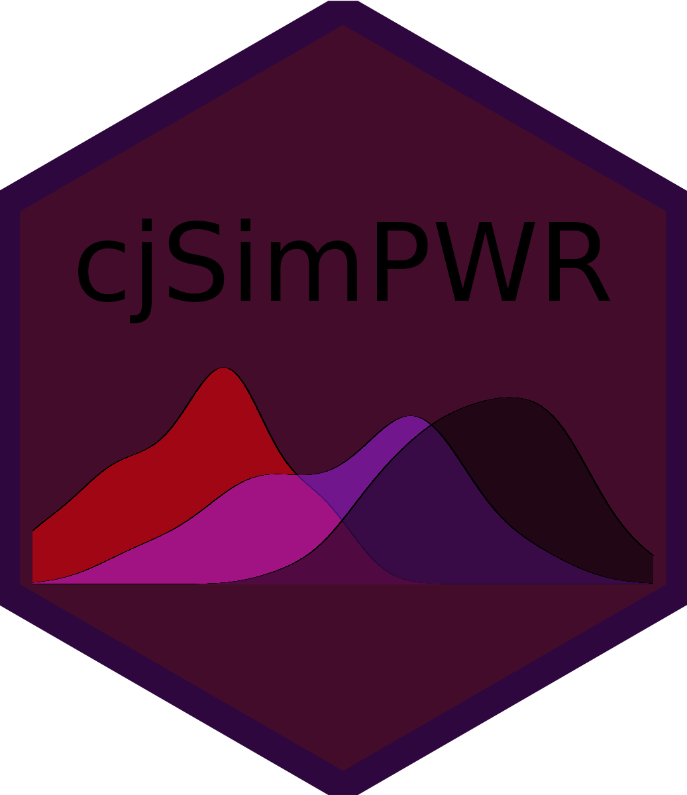

Power Analyses for Conjoint Experiments Using Simulation Techniques
================



Using the simulation developed in [Stefanelli, A., & Lukac, M.
(2020)](https://osf.io/preprints/socarxiv/spkcy/), this R package
provides an extensive set of functions to simulate conjoint data,
calculate power, Type S and Type M error for forced-choice conjoint
experiments that use the [Hainmueller, J., Hopkins, D., & Yamamoto, T.
(2014)](https://www.cambridge.org/core/journals/political-analysis/article/causal-inference-in-conjoint-analysis-understanding-multidimensional-choices-via-stated-preference-experiments/414DA03BAA2ACE060FFE005F53EFF8C8)
framework.

A shiny app is available for simple designs
[https://mblukac.shinyapps.io/conjoints-power-shiny/](hhttps://mblukac.shinyapps.io/conjoints-power-shiny/)

## Installation

You can install the development version of cjsimPWR using the following
lines of code in R:

``` r
if(!require(devtools)) install.packages("devtools")
library(devtools)
devtools::install_github("albertostefanelli/cjsimPWR")
```

## Usage

In its current development version, the package consists of a series of
function to simulate conjoint data, analyse the simulate data, and
perform a simulation-based power analysis. The main function is
`power_sim()` that can be used to calculate power, Type S and Type M
error based on the design parameters of the conjoint experiment.

## Examples

``` r
# This calculates power for an experiments with the following attributes with no expected interaction effects
# Number of attributes (n_attributes): 3
# Number of levels Attribute 1 (n_levels): 2
# Number of levels Attribute 2 (n_levels): 3
# Number of levels Attribute 1 (n_levels): 5
# Number of respondents (units): 500
# Number of tasks per respondent (n_tasks): 5
# Hypothesized AMCE compared to reference level (true_coef): 
#### Attribute 1 - Level 1 (ref: 0): 0.20 
#### Attribute 2 - Level 1 (ref: 0): -0.1 
#### Attribute 2 - Level 2 (ref: 0): 0.10 
#### Attribute 3 - Level 1 (ref: 0): -0.03 
#### Attribute 3 - Level 2 (ref: 0) -0.1 
#### Attribute 3 - Level 3 (ref: 0): -0.1 
#### Attribute 3 - Level 4 (ref: 0): 0.1
# Individual level heterogeneity (sigma.u_k): 0.05 
# Number of simulations (sim_runs): 100
# Seed for reproducibility of the simulation results (seed) : 2114

df_power <- power_sim(
  n_attributes = 3,
  n_levels = c(2, 3, 5),
  units = 600,
  n_tasks = 5,
  true_coef = list(0.2, c(-0.1, 0.1), c(-0.03, -0.1, -0.1, 0.1)),
  sigma.u_k = 0.05,
  sim_runs = 100,
  seed = 2114
)

df_power |> print(n=40)


# This calculates power for an experiments with 3 subgroups of respondents (Democrats, Independents, Republicans) with Hypothesized differences in conditional AMCEs (i.e., subgroup analysis). 

df_power_interaction <- power_sim(
          n_attributes = 3,
          n_levels = c(2, 3, 6),
          n_tasks = 4,
          group_name = c("Democrats", "Independents", "Republicans"),
          units = c(500, 200, 500, 100),
          true_coef = list("Democrats" = list(0.2, c(-0.1, 0.1), c(-0.1, -0.1, -0.1, 0.1, -0.03)),
                           "Independents" = list(0.1, c(-0.2, 0.05),  c(-0.1, 0.1, 0.1, 0.3, 0.01)),
                           "Republicans" = list(0.1, c(-0.1, -0.0005),  c(-0.1, 0.2, -0.1, 0.1, -0.01)),
                           ),
          sigma.u_k = 0.05,
          sim_runs = 100,
          seed = 12
)

df_power_interaction |> print(n=40)
```
